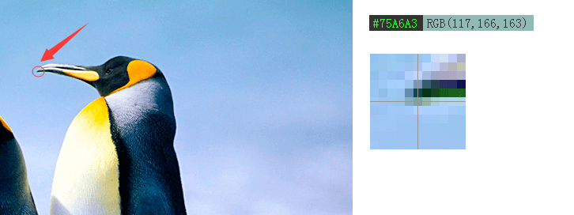
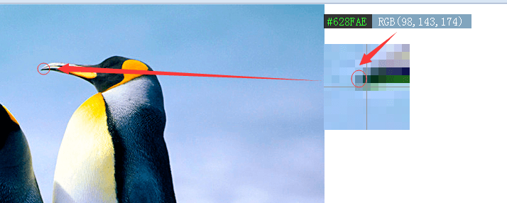
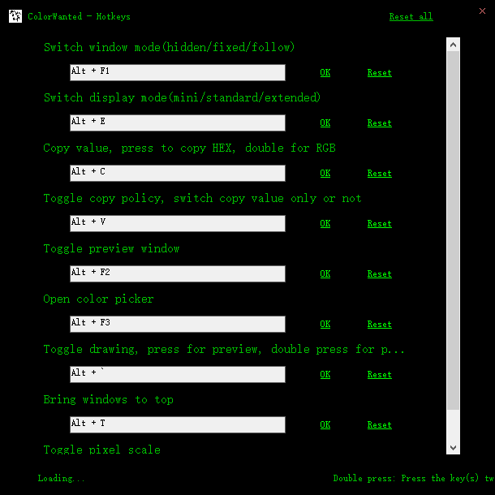
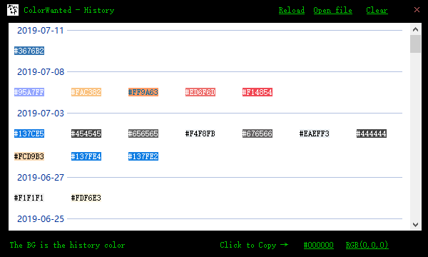
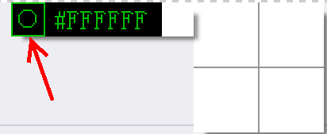

# ColorWanted

**[点击此处](README.zh-CN.md)** 查看中文文档。

This is a screen color picker on **Windows** system. **RGB**、**HSL**、**HSB/HSV**、**HSI** are supported。

If you got any issue or suggestion, [issue](https://github.com/hyjiacan/ColorWanted/issues/new) is always welcome.

## Requirements

- Windows XP [(2.6.1 and lower) .NET Framework 4.0](http://www.microsoft.com/zh-cn/download/details.aspx?id=17718)    
- Windows7/8/10 [(2.6.2 and later) .NET Framework 4.5.2](https://www.microsoft.com/zh-CN/download/details.aspx?id=42642)

Note: Because of [Github upgrade SSL as Tls12](https://blog.github.com/2018-02-23-weak-cryptographic-standards-removed/)(happened at Feb. 2018),
.NET4.0/WindowsXP was not supported since version `2.6.2`(.NET4.0 dose not support `Tls12`, so I removed auto update from old version `2.6.1`)

# Source & Download

- [Source Code](https://github.com/hyjiacan/ColorWanted)
- [Stable](https://github.com/hyjiacan/ColorWanted/releases)
- [Develpment](https://github.com/hyjiacan/ColorWanted/blob/master/ColorWanted/bin/Release/ColorWanted.exe?raw=true)
- [2.6.1.3](https://github.com/hyjiacan/ColorWanted/blob/2.6.1.3/ColorWanted/bin/Release/ColorWanted.exe?raw=true)

# Usage

You got 2 windows after ColorWanted startup: one to show color value (HEX or RGB), another to preview scaled pixels.

Window position and options are always stored immediately while changed (contains changed by hotkey), you can open the config file via `Open Config` menu item on tray context menu.

- **color value window**
Show the color value of pixel which cursor on, follow color space are available:
- RGB(in HEX)
- RGB(in Decimal)
- [HSL](https://en.wikipedia.org/wiki/HSL)
- [HSB](https://en.wikipedia.org/wiki/HSB)
- [HSI](https://en.wikipedia.org/wiki/HSL_and_HSV)

You can toggle visible them except `RGB` (via tray context menu or hotkey **Alt+E**)

- **pixel preview window**
Preview pixels around pixel which cursor on.
You can scroll mousewheel up to zoom in and down to zoom out preview window.

- **Color palette**
Open system color palette, a copied color would be the default color in palette.
A **HEX** color value will be copy after button **OK** clicked.

- **Copy policy**
You can just copy the color value by check **HEX only**/**RGB only** under **Copy policy**.
- **HEX ony**: copy **FFFFFF** only, without symbol **#**
- **RGB only**: copy **255,255,255** only, without **RGB()**.

Hotkey: `Alt+V`

- **Screenshot**
Click the **circle button** front of main window to take screenshot (via tray context menu or hotkey **Alt+X**).

## Hotkey

> **Double click** Press keys in 1 second

- **Alt+C** Copy HEX value, double click to copy RGB value
- **Alt+V** Switch copy policy
- **Alt+E** Switch display mode(mini/standard/extended)
- **Alt+F1** Switch window mode(hidden/fixed/follow)
- **Alt+F2** Show/hide preview window
- **Alt+F3** Open color palette
- **Alt+`** Pause/resume preview, double click to pause/resume pick color
- **Alt+T** Bring color windows to the top, escapse from any windows on it
- **Alt+P** Whether to preview with pixel scale
- **Alt+X** Take screenshot

> Here is the *default* hotkeys, you can change them by **Hotkey** menu.

You can pause/resume preview by right click on preview window

## Screenshoot

### Pick color

> Pick the color of pixel which cursor on, color windows show HEX value and RGB value. The cross point show the scaled pixel.

### Pixel scale

> If you want to get color from a exactly pixel, you can just press **Alt+`** to pause preview, then move your cursor on preview window, then pick the color you want.

### Customize hotkeys

> You can find all hotkey definitions here.

### History

### Take screenshot

## Open source license

Colorwanted is under license [GPL V3](http://www.gnu.org/licenses/gpl-3.0.html)

## Thanks

- [Pick color](http://www.haolizi.net/example/view_102.html)
- [Drag window](http://blog.csdn.net/skysky01/article/details/9902247)
- [Global hotkey](http://www.cnblogs.com/Randy0528/archive/2013/02/04/2892062.html)
- [Hide window from `Alt+Tab` list](http://bbs.csdn.net/topics/380256152#post-390885609)
- [Write system clipboard with Windows API](http://www.cnblogs.com/wind-net/archive/2012/11/01/2749558.html)
- [data type in C++ & data type in C#](http://www.cnblogs.com/chuncn/archive/2011/12/20/2294096.html)
- [Hotkey input](http://www.jb51.net/article/60257.htm)
- [convert RGB into HSB/HSL](http://blog.csdn.net/jiangxinyu/article/details/8000999)    
- [convert RGB into HSI](http://blog.csdn.net/yangleo1987/article/details/53171623)
- [Blur the image](https://www.cnblogs.com/yeye518/p/4161067.html)
- [Make image transparency](https://zhidao.baidu.com/question/72707659.html)
- [Draw arrow in WPF](https://blog.csdn.net/u012366767/article/details/84857000)
- [Draw dashed line in WPF](https://blog.csdn.net/openzpc/article/details/48468031)